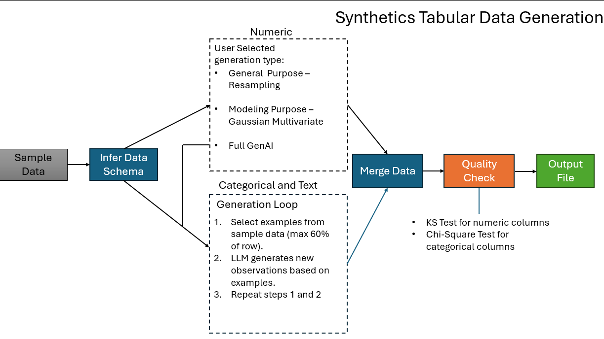

# SyntheSys: Synthetic PDF and Tabular Data Generator

This repository contains a Streamlit application for generating production-like data and content without exposing sensitive information. It supports two workflows:
1) PDF content regeneration using an LLM while preserving approximate layout
2) Tabular synthetic data generation using a hybrid approach that combines statistical modeling and LLM-based text/category synthesis.

## System Architecture



The pipeline consists of the following stages:

1. Infer Data Schema  
   The app inspects the uploaded sample dataset and infers a schema that classifies columns as numeric, categorical, or free‑form text.

2. Numeric Generation (three user-selectable modes)  
   - General (Resampling): draws samples from the original numeric columns to match their marginal distributions.  
   - Modeling (Gaussian Multivariate): fits a Gaussian copula–based multivariate model to preserve cross‑column correlation in addition to marginals.  
   - GenAI: delegates numeric synthesis to the LLM along with non‑numeric fields.

3. Categorical and Text Generation (LLM loop)  
   The app selects representative example rows (bounded by context window, max 60% of the sample) and prompts the LLM to create new rows that preserve per‑column distributions and approximate text characteristics. The generation loop repeats until the requested number of observations is produced.

4. Merge Data  
   Numeric outputs are combined with the LLM‑generated categorical/text outputs and aligned to the original column order.

5. Quality Check  
   Statistical tests are run to verify similarity between original and generated data: Kolmogorov–Smirnov (numeric) and Chi‑Square (categorical).

6. Output File  
   The final synthetic dataset is provided as a downloadable CSV. For PDFs, regenerated files are produced directly and, for multiple outputs, bundled as a ZIP.

## Features

- Streamlit UI for both PDF and Tabular workflows.
- AWS Bedrock integration to invoke Anthropic Claude 3.5 for LLM tasks.
- Schema inference for column typing and basic statistics.
- Three numeric generation modes to balance speed vs. fidelity.
- Categorical/text synthesis guided by examples and schema constraints.
- Built‑in quality checks (KS and Chi‑Square) and distribution visualizations.
- S3 upload/read helpers to operate with files stored in your AWS account.
- Batch generation for multiple PDFs; one‑click ZIP download.

## Installation

Requires Python 3.10+.

```bash
python -m venv .venv
source .venv/bin/activate   # Windows: .venv\Scripts\activate
pip install -r requirements.txt
```

## Running the App

```bash
streamlit run Synth_UI_Full.py
```

Open the local URL printed by Streamlit (typically http://localhost:8501).

## Configuration

### AWS and Bedrock
- Region is set to `us-east-1` in the code. Ensure credentials are available via environment variables, an instance role, or your local AWS profile.
- Model ID: `anthropic.claude-3-5-sonnet-20240620-v1:0`.
- The PDF pipeline uses Amazon Textract to extract text and table layout when reading from S3.

### S3 Usage
- The UI uploads user files to a configured S3 bucket (see code for bucket name constants or pass your own). You can adapt the S3 bucket and key logic as needed.

## Using the App

### PDF Generation
1. Select “Generate PDF(s)”.  
2. Upload a PDF or provide an S3 location.  
3. Optionally adjust `top_k`, `top_p`, and `temperature`.  
4. Generate one or more PDFs; the app returns individual files or a ZIP with all outputs.

### Tabular Data Generation
1. Select “Generate Tabular Data”.  
2. Upload a CSV sample.  
3. Choose a use case: General (Resampling), Modeling (Gaussian Multivariate), or GenAI.  
4. Specify the number of observations to generate.  
5. Download the generated CSV and review the Quality Check table and distribution plots.

## How Schema and the LLM Are Used

- Schema Inference  
  The app computes per‑column type and statistics. Numeric columns capture moments and quantiles; categorical columns capture category proportions; text columns capture length ranges and examples. This schema guides both numeric synthesis and LLM prompts.

- LLM‑Driven Generation  
  For categorical and text columns (and optionally numeric in GenAI mode), the LLM receives:  
  - a curated set of example rows (capped by context window and 60% of the sample to maintain variety), and  
  - the inferred schema as constraints for category frequencies and text lengths.  
  The LLM outputs new rows in a strict column:value format which are parsed into a DataFrame.

- Correlation Preservation (Modeling mode)  
  When “Modeling” is selected, a Gaussian multivariate model is fit to numeric columns to preserve inter‑column correlation structure while matching marginal distributions.

## Outputs
- PDF: regenerated file(s) with rewritten content mapped to approximate original layout.  
- CSV: synthetic tabular dataset with the same columns as the input, generated to the requested size.  
- Quality Check: summary table with p‑values (KS for numeric, Chi‑Square for categorical) and distribution plots for a selected column.

## Project Structure
```
.
├── Synth_UI_Full.py         # Streamlit app for PDF and Tabular generation
├── system_diagram_synth.png # System architecture diagram (this README embeds it)
├── requirements.txt         # Python dependencies
└── README.md
```

## Notes and Guidance
- Keep the uploaded sample representative of the distributions you want to emulate.  
- For sensitive domains, review outputs for privacy constraints; this tool aims to generate similar but not identical data.  
- For large categorical vocabularies or free‑text columns, consider curation or vocabulary caps to control LLM variability.  
- The quality tests indicate statistical similarity but do not guarantee privacy or complete fidelity.

## License
MIT (or update to your preferred license).
